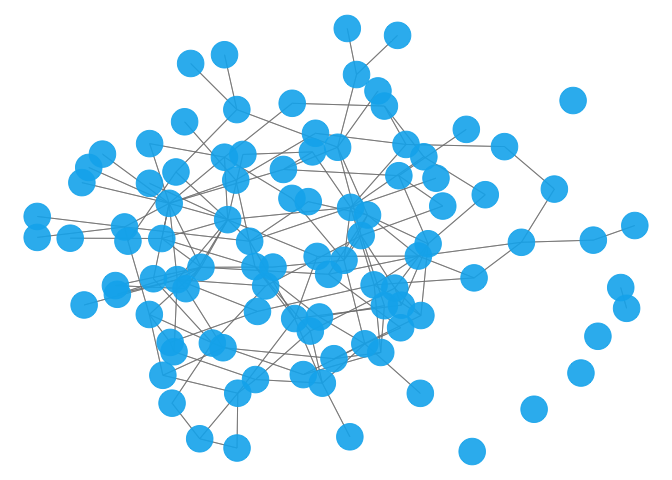

<!-- README.md is generated from README.Rmd. Please edit that file -->
tailoredGlasso
==============

<!-- badges: start -->
[](https://www.tidyverse.org/lifecycle/#experimental) [](https://opensource.org/licenses/MIT) <!-- badges: end -->

<!-- IF ON CRAN []
[]---->
<!--WHEN TESTING IS INCLUDED [] --->
<!--PAPER HERE []---->
This package implements the tailored graphical lasso for data integration in Gaussian graphical models. The tailored graphical lasso is an extension of the weighted graphical lasso (Friedman, Hastie, and Tibshirani (2008), Y. Li and Jackson (2015)) for graph reconstruction. The objective is to get better utilisation of the available prior information, while ensuring that the introduction of prior information may not decrease the accuracy of the resulting inferred graph. The method takes a data matrix (or a covariance matrix) for which a weighted graphical lasso graph is to be inferred, as well as a prior weight matrix, and transforms the prior weights to more appropriate values with the logistic function. The parameters of the weight transformation are chosen with a data-driven approach.

Installation
------------

To install the current development version, use

``` r
remotes::install_github("camiling/tailoredGlasso")
```

If you would like to install all packages of the models we currently support, use

``` r
remotes::install_github("camiling/tailoredGlasso", dependencies = TRUE)
```

If you would also like to build and view the vignette locally, use

``` r
remotes::install_github("camiling/tailoredGlasso", dependencies = TRUE, build_vignettes = TRUE)
browseVignettes("tailoredGlasso")
```

Example
-------

The following examples show how `tailoredGlasso` selects how strongly the information from a prior weight matrix should be included, and returns the resulting precision matrix estimate of the data. In the first example, the prior weight matrix is very informative for the data of interest, in the second the prior weight matrix is completely uninformative for the data. In the first case, *k* is selected to very big and we get a high precision considering the high-dimensionality of the problem. In the latter case, *k* is selected to be very small and hardly any prior information is incorporated into the model.

The data is generated using the `huge` R package (Jiang et al. (2020)), as it includes functionality for generating data from a Gaussian graphical model. The networks we generate are *scale-free*, which is a known trait in many real-life networks such as genomic networks (Kolaczyk (2009)).

``` r
#  scale-free data where prior weight matrix is highly informative for the data of interest.
set.seed(123)
n <- 80
p <- 100
# use huge to generate data.
dat <- huge::huge.generator(n = n, d = p, graph = "scale-free", verbose = F)
prec.mat <- dat$omega # true precision matrix
prior.mat <- abs(cov2cor(prec.mat)) # the prior weights are the absolute values of the true partial correlations, thus very informative.
# perform the tailored graphical lasso
res <- tailoredGlasso(dat$data, prior.mat, scale = T, verbose = F)
#> Scaling data...
#> Selecting lambda for the unweighted graph...
#> Selecting k...
res$k.opt # k is chosen very large
#> [1] 99
adj.mat <- res$theta.opt != 0 # the adjacency matrix of the corresponding graph
precision(abs(prec.mat) > 1e-7, adj.mat) # high precision considering the high-dimensionality of the problem.
#> [1] 0.5625


# scale-free data where prior weight matrix is completely uninformative for the data of interest.
set.seed(123)
n <- 80
p <- 100
dat <- huge::huge.generator(n = n, d = p, graph = "scale-free", verbose = F)
dat.prior <- huge::huge.generator(n = n, d = p, graph = "scale-free", verbose = F)
prec.mat.prior <- dat.prior$omega # true precision matrix
prior.mat <- abs(cov2cor(prec.mat.prior)) # the prior weights are the absolute values of completely unrelated partial correlations, thus completely uninformative.
res <- tailoredGlasso(dat$data, prior.mat, scale = T, verbose = F)
#> Scaling data...
#> Selecting lambda for the unweighted graph...
#> Selecting k...
res$k.opt # very small k is chosen
#> [1] 0.23
adj.mat <- res$theta.opt != 0 # the adjacency matrix of the corresponding graph
precision(abs(dat$omega) > 1e-7, adj.mat) # lower precision as prior matrix did not provide any additional information.
#> [1] 0.2857143
```

The resulting tailored graphical lasso graph can be visualised with functions from the `network` and `ggnet2` libraries.

``` r
set.seed(1234)
net <- network::network(adj.mat)
GGally::ggnet2(net, alpha = 0.9, mode = "fruchtermanreingold", color = "deepskyblue2")
#> Registered S3 method overwritten by 'GGally':
#>   method from   
#>   +.gg   ggplot2
```



Contribution
------------

All feedback and suggestions are very welcome. If you have any questions or comments, feel free to open an issue [here](https://github.com/Camiling/TailoredGlasso/issues).

References
----------

Friedman, Jerome, Trevor Hastie, and Robert Tibshirani. 2008. “Sparse Inverse Covariance Estimation with the Graphical Lasso.” *Biostatistics* 9: 432–41. doi:[10.1093/biostatistics/kxm045](https://doi.org/10.1093/biostatistics/kxm045).

Jiang, Haoming, Xinyu Fei, Han Liu, Kathryn Roeder, John Lafferty, Larry Wasserman, Xingguo Li, and Tuo Zhao. 2020. *Huge: High-Dimensional Undirected Graph Estimation*. <https://CRAN.R-project.org/package=huge>.

Kolaczyk, Eric D. 2009. *Statistical Analysis of Network Data: Methods and Models*. New York, NY: Springer Science & Business Media.

Li, Yupeng, and Scott A. Jackson. 2015. “Gene Network Reconstruction by Integration of Prior Biological Knowledge.” *G3: Genes, Genomes, Genetics* 5: 1075–9. doi:[10.1534/g3.115.018127](https://doi.org/10.1534/g3.115.018127).
