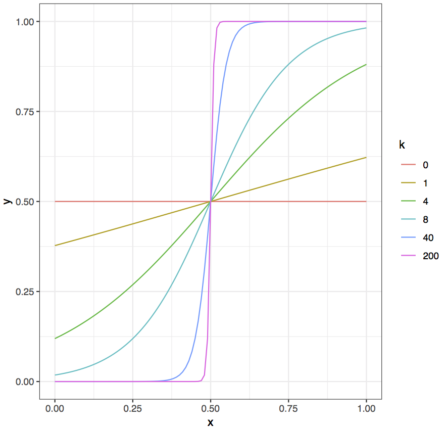

```{r, include = FALSE}
knitr::opts_chunk$set(
  collapse = TRUE,
  comment = "#>",
  fig.path = "../man/figures/vignette-",
  fig.width = 7,
  fig.height = 3
)
```

```{r setup, include=FALSE, warning=FALSE}
library(tailoredGlasso)
```
 
 
> [Introduction](#intro)

> [Overview of package](#overview)

> [The tailored graphical lasso](#tailoredglasso)

> [Examples](#ex)

<!-- [Comparison to the graphical lasso and the weighted graphical lasso](#compare) -->

<a id="intro"></a>

# Introduction
 

The `tailoredGlasso` package implements the tailored graphical lasso for data integration in Gaussian graphical models. The tailored graphical lasso is an extension of the weighted graphical lasso (@Friedman08, @Li15) for graph reconstruction. The objective is to get better utilisation of the available prior information, while ensuring that the introduction of prior information may not decrease the accuracy of the resulting inferred graph. The method takes a data matrix (or a covariance matrix) for which a weighted graphical lasso graph is to be inferred, as well as a prior weight matrix, and transforms the prior weights to more appropriate values with the logistic function. The parameters of the weight transformation are chosen with a data-driven approach. 


<a id="overview"></a>

<br>

# Overview of package

## Functions

Here is an overview of the main functions. You can read their documentation and see examples 
with `?function_name`.

----------------------------- ------------------------------------------------------
Function Name                 Description
----------------------------- ------------------------------------------------------
`tailoredGlasso`              Performs the tailored graphical lasso.

`eBIC`                        Calculates the extended BIC (eBIC) score of an estimated precision matrix.

`sparsity`                    Finds the sparsity of a graph.

`precision`                   Finds the precision of an estimated graph. 

`recall`                      Finds the recall of an estimated graph.

`confusion.matrix`            Finds the confusion matrix between a graph and its estimate.
----------------------------- --------------------------------------------------

: Main functions in the `tailoredGlasso` package.


<a id="tailoredglasso"></a>

<br>

# The tailored graphical lasso

 
##Gaussian graphical network models

Network models are popular tools for modelling interactions and associations. While the edges of correlation networks are indicative of direct associations, correlation is not a neccesary or suffient condition (@chen2018) for a direct association. In a conditional independence network, the effect of other variables (nodes) is adjusted for. In such a graph, there is an edge between two nodes if and only if there is a direct association between them when conditioning upon the rest of the variables in the graph.

Inferring a conditional independence network requires a measure of the conditional dependence between all pairs of nodes or variables. Given that each node is associated with a measurable *node attribute*, one possible approach is to assume a Gaussian graphical model, where the multivariate random vector $(X_1, \ldots, X_{p})^T$ of node attributes is assumed to be multivariate Gaussian with mean vector $\boldsymbol{\mu}$ and covariance matrix $\boldsymbol{\Sigma}$. A conditional independence network may then be determined from the inverse covariance matrix, or *precision matrix*, $\boldsymbol{\Theta}=\boldsymbol{\Sigma}^{-1}$. Given the entries $\theta_{ij}$ of $\boldsymbol{\Theta}$, the conditional (or partial) correlation between nodes, or variables, $i$ and $j$ conditioned upon all others is given by 

$$
\rho_{ij\vert V\backslash \{i,j\} } = - \frac{\theta_{ij}}{\sqrt{\theta_{ii}\theta_{jj}}}
$$
where $V$ is the set of all node pairs. Since correlation equal to zero is equivalent to independence for Gaussian variables, a conditional independence graph may be constructed by determining the non-zero entries of the precision matrix $\boldsymbol{\Theta}$ and assigning edges to the corresponding node pairs. The resulting model is a *Gaussian graphical model*, with the edges representing conditional dependence.

Due to the high-dimensional problem frequently encountered in real-life data, where the number of observations $n$ is much smaller than the number of parameters to estimate (in this case elements in $\boldsymbol{\Theta}$), the sample covariance matrix is often not of full rank. Thus, the inverse covariance matrix is often not possible to compute directly, and alternative approaches are neccessary.  


## The graphical lasso

The *sparsity* of a graph is the number of edges divided by the maximal number of edges the graph can have. If the sparsity of a graph is sufficiently small, $\boldsymbol{\Theta}$ has enough zero elements to be of full rank and thus invertible and well defined. We then say that the graph, or precision matrix, is sparse.

The graphical lasso performs sparse precision matrix estimation by imposing an $L_1$ penalty on the matrix entries (@Friedman08). The graphical lasso aims to solve the penalized log-likelihood problem

$$
 \widehat{\boldsymbol{\Theta}} = \text{argmax}_{\boldsymbol{\Theta} \succ 0} \Big \{\log (\det\boldsymbol{\Theta}) - \text{tr} (\boldsymbol{S} \boldsymbol{\Theta}) - \lambda \| \boldsymbol{\Theta }\|_1 \Big \}, 
$$

where  \(\boldsymbol{\Theta} \succ 0\) is the requirement that \(\boldsymbol{\Theta} \) is positive definite, tr denotes the trace and $\|\cdot \|_1$ denotes the $L_1$ norm. Letting $\boldsymbol{X}$ be the $n\times p$ matrix of observed data, with each row corresponding to one of $n$ observations of the multivariate random vector of attributes, $\boldsymbol{S}$ is the sample covariance matrix of the data.  

The graphical lasso is implemented in the R packages `glasso` (@glasso) and `huge` (@huge), with the latter providing several routines for selection of the penalty parameter $\lambda$.


## The weighted graphical lasso

@Li15 propose an alternative version of the graphical lasso in which prior information about the network is incorporated into the model with the aim of improving the results. In the *weighted graphical lasso*, a *prior* penalty matrix $\boldsymbol{P} = \{p_{ij}\}$ is introduced, with entries $p_{ij}\in[0,1]$ which represent prior or external information about the existence of the edges. Small values of $p_{ij}$ represent strong a priori evidence for association between genes/nodes $i$ and $j$, yielding a smaller penalty of the corresponding element in the precision matrix. The penalty term in the penalized log likelihood problem then becomes $\lambda \| \boldsymbol{P}\star \boldsymbol{\Theta }\|_1$ where $\star$ denotes element-wise matrix multiplication. The method is implemented in the R package `huge` (@huge). 


## The tailored graphical lasso 

The tailored graphical lasso aims to handle prior information of unknown accuracy more effectively than the weighted graphical lasso. The method transforms the prior weights with the logistic function

$$
g_k(w) = \frac{1}{1+\exp{(-k(w-w_0))}}
$$
where $w_0$ is the sigmoid midpoint and $k$ the steepness parameter. These parameters are selected by the tailored graphical lasso so that the prior weights are transformed to a more suitable range. The function is plotted below with $w_0=0.5$ and with different values of $k$. 

```{r chunk3, warning=FALSE,out.width = "400px", fig.align='center', echo=FALSE}

```


Evidently, for $k=0$ the function maps all weights to the same value, and we just get the ordinary unweighted graphical lasso. As $k$ grows, the sigmoid function becomes more step-like. For $k=40$ it is very near being a step function and for $k=200$ it essentially is one. The weights will then all be mapped close to either 0 or 1, depending on whether they are above or below $w_0$. The transformed weights will always be mapped into $[0,1]$, as required for the weights in the weighted graphical lasso. The logistic function never becomes exactly the identity function $g_k(w) = w$ that would map all weights to themselves corresponding to the ordinary weighted graphical lasso. As we see, it does however approximate the identity function well for $k=4$. Thus, the graphical lasso and weighted graphical lasso can be considered special cases of the tailored graphical lasso, and the selected $k$ measures the usefulness of the prior information.


The tailored graphical lasso begins by selecting the total amount of penalization to be used on the elements of $\boldsymbol{\Theta}$. This amount is selected without taking the prior weight matrix into account, using the sparsity selection method StARS (@Liu10) with the unweighted graphical lasso to find a common penalty parameter $\lambda$. StARS is used as it is a stable criterion for graph sparsity selection \cite{Liu10}. By preserving the amount of penalty, we achieve similar sparsity for each $k$ without having to repeatedly perform StARS, which is computationally exhaustive.

The sigmoid midpoint $w_0$ is chosen as the lower $\beta$-quantile of the prior weights, where $\beta$ is the variability threshold used in the StARS tuning of the ordinary graphical lasso graph. This is usually set to a default value of $0.05$. This way, one avoids having to tune a second parameter. The choice of $w_0$ is justified by the fact that $\beta$ is the upper limit set in the StARS selection for the estimated probability of an inferred edge being wrong. This means one can expect up to a fraction $\beta$ of the inferred edges of the final graph as tuned by StARS to be incorrect.

The tailored graphical lasso selects $k$ by assessing which value of $k$ that results in the estimated precision matrix fitting the data the best. This is done with the extended BIC (eBIC), which is specifically designed for selection in high-dimensional graph settings and computationally efficient (@Foygel10). For a given set of edges $E$ it is given by 

$$
BIC_{\gamma}(E)= -2 l_p( \boldsymbol{\hat{\Theta}}( E) ) + \vert E \vert \log{n} + 4 \vert E \vert \gamma \log{p}
$$

where $\vert E \vert$ is the number of edges in the edge set $E$ and where \(\gamma \in [0,1]\) imposes additional penalty on edges. Due to the penalty preservation, the sparsity of the graphs being compared will be quite similar, and so the choice of $\gamma$ is not critical. It should however be chosen to reflect how concerned one is with false discoveries. The larger it is, the more are larger graphs penalized. 

In the tailored graphical lasso, a small selected $k$ can be interpreted as an exclusion of the prior information and a large one as an inclusion and enhancement of it, giving the edges weights close to 0 or 1 depending on whether their prior weights are below or above the threshold $w_0$. This interpretability is convenient, as the optimal value of $k$ can tell how useful the prior weights are and whether increasing their differences even more improves the model.


<a id="ex"></a>

<br>

# Examples

The main function `tailoredGlasso` takes an $n\times p$ data matrix and a $p\times p$ prior weight matrix, and uses the tailored graphical lasso to estimate the inverse covariance matrix (precision matrix) of the data. A graph structure can then be determined by letting there be an edge between all pairs of variables, or nodes, $(i,j)$ whose corresponding element in the estimated precision matrix is non-zero. 

`tailoredGlasso` selects the steepness parameter $k$ in the logistic function used to transform the weights with a data-driven approach. Using the eBIC criterion for the selection, the method ensures that prior information is only included to the extent that it improves the model fit. 

Below we show one example where the prior weight matrix is very informative for the data of interest, and one where the prior weight matrix is completely uninformative for the data. In the first case, $k$ is selected to very big and we get a high precision considering the high-dimensionality of the problem. In the latter case, $k$ is selected to be very small and hardly any prior information is incorporated into the model. 

The data is generated using the `huge` R package (@huge), as it includes functionality for generating data from a Gaussian graphical model. The networks we generate are *scale-free*, which is a known trait in many real-life networks such as genomic networks (@kolaczyk09). 

```{r, warning = FALSE}
#  scale-free data where prior weight matrix is highly informative for the data of interest.
set.seed(123)
n <- 80
p <- 100
dat <- huge::huge.generator(n = n, d = p, graph = "scale-free",verbose=F)
prec.mat <- dat$omega # true precision matrix
prior.mat <- abs(cov2cor(prec.mat)) # the prior weights are the absolute values of the true partial correlations, thus very informative. 
res <- tailoredGlasso(dat$data, prior.mat, scale = T,verbose=F)
res$k.opt # k is chosen very large
adj.mat <- res$theta.opt !=0 # the adjacency matrix of the corresponding graph 
precision(abs(prec.mat) > 1e-7, adj.mat) # high precision considering the high-dimensionality of the problem. 


# scale-free data where prior weight matrix is completely uninformative for the data of interest.
set.seed(123)
n <- 80
p <- 100
dat <- huge::huge.generator(n = n, d = p, graph = "scale-free",verbose=F)
dat.prior <- huge::huge.generator(n = n, d = p, graph = "scale-free",verbose=F)
prec.mat.prior <- dat.prior$omega # true precision matrix
prior.mat <- abs(cov2cor(prec.mat.prior)) # the prior weights are the absolute values of completely unrelated partial correlations, thus completely uninformative. 
res <- tailoredGlasso(dat$data, prior.mat, scale = T,verbose = F)
res$k.opt # very small k is chosen
adj.mat <- res$theta.opt !=0 # the adjacency matrix of the corresponding graph 
precision(abs(dat$omega) > 1e-7, adj.mat) # lower precision as prior matrix did not provide any additional information. 
```

The resulting tailored graphical lasso graph can be visualised with functions from the `network` and `ggnet2` libraries. 


```{r,fig.align='center', out.width='60%',results='hide'}
set.seed(1234)
net =network::network(adj.mat)
GGally::ggnet2(net,alpha=0.9,mode = "fruchtermanreingold",color = 'deepskyblue2')

```

## References

